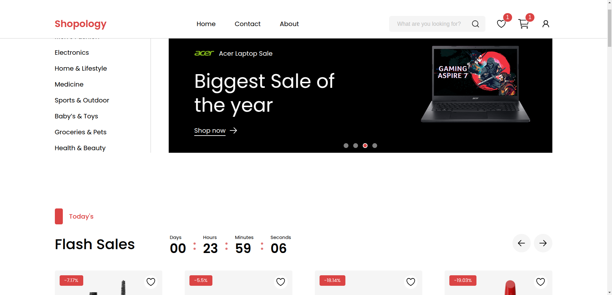
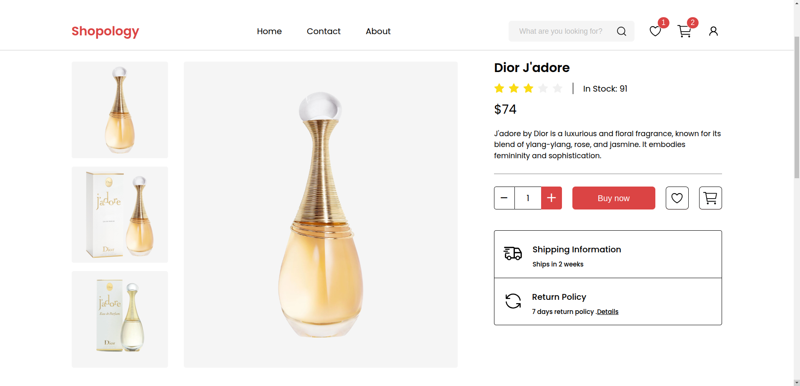
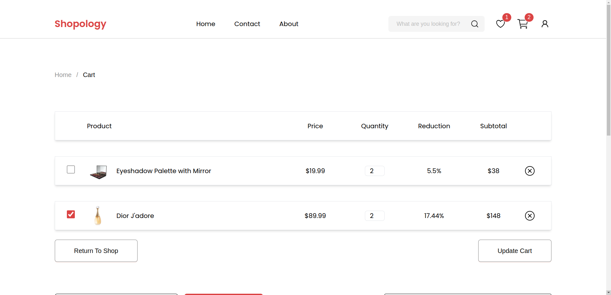

# Shopology

Shopology is a modern and dynamic e-commerce website designed to provide users with a seamless shopping experience. The platform features a robust backend built with NestJS and PostgreSQL and a sleek, responsive frontend utilizing React, Vite, Tailwind CSS, TypeScript, and Ant Design.

## Deployment
- **Live website**: [https://shopology.netlify.app](https://shopology.netlify.app)
  
**Note**: The server might take some time to respond due to free hosting limitations.

## References
- **Design reference**: [Full E Commerce Website UI UX Design](https://www.figma.com/community/file/1219312065205187851/full-e-commerce-website-ui-ux-design)

## Screenshots
**Home page**:

**Product page**: 

**Cart page**: 

## Folder Structure
- **Backend/**: Contains the source code for the backend service.
- **Frontend/**: Contains the source code for the frontend application.

## Setup Instructions
- For backend setup, refer to the [Backend README](./Backend/README.md).
- For frontend setup, refer to the [Frontend README](./Frontend/README.md).

